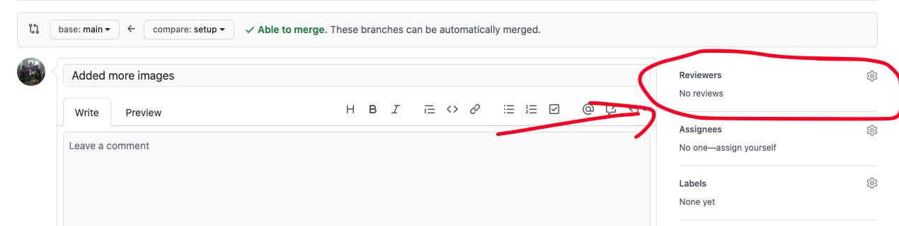

# Dungeon Meister

## Overview

In this project, you will create a basic menu for an RPG game which allows you to customize the Armor and Weapon a character has equipped. Through this process, you will explore the basics of Arrays and ASCII character representations.

* [Setup your repository](#setup-your-repository)
  * [Sign up for the project](#sign-up-for-project)
* [Milestones](#milestones)
  * [Milestone 1](#milestone-1)
  * [Milestone 2](#milestone-2)
  * [Milestone 3](#milestone-3)
* [Grading](#grading)
  * [Computational Thinking](#computational-thinking)
  * [Computing, Programming and Practice](#computing-programming-and-practice)
  * [Skills of a Student](#skills-of-a-student)
* [Getting Help](#getting-help)

## Setup your repository

### Sign up for Project

Sign up for the project repository here: [TODO](TODO)

After your repository has initialized it, clone it to your computer. I recommend
putting it in your `ap-csp` directory.

After you've cloned your repository, run the `setup.sh` script in the root of
that repository to initialize it's configuration.

Upon completion it should display a message similar to this one:

```
######################################################
# SETUP IS COMPLETE. YOU SHOULD NOW CREATE A         #
# `develop` BRANCH BY RUNNING THE FOLLOWING COMMAND: #
#                                                    #
# git checkout -b develop                            #
#                                                    #
# THEN PUSH THAT BRANCH TO GITHUB BY RUNNING THE     #
# FOLLOWING COMMAND:                                 #
#                                                    #
# git push -u origin develop                         #
#                                                    #
# AFTER PUSHING, OPEN A PULL REQUEST FROM YOUR       #
# `develop`  BRANCH TO THE `main` BRANCH BY VISITING #
# THIS REPO ON GITHUB, CLICKING `Pull Requests`      #
# THEN `New pull request`. THE BASE BRANCH SHOULD BE #
# `main` and THE COMPARE BRANCH SHOULD BE `develop`. #
#                                                    #
# FINALLY, ADD YOUR INSTRUCTOR AS A REVIEWER ON      #
# GITHUB. THIS IS HOW YOUR INSTRUCTOR WILL SEE YOUR  #
# WORK.                                              #
######################################################
```

Follow the directions to create a `develop` branch as well as pushing your
`develop` branch to Github.

Finally, create a pull request from your `develop` branch to the `main` branch
and assign `jcollard` as a reviewer.





## Milestones

### Milestone 1

Due Date: Feb Dec. 4th @ 8AM

For your first Milestone, you will setup your project and create a TextRenderer that allows you to dynamically generate text to the screen using a font sprite sheet. The following series of videos will guide you through this process

[01. Setup](https://edpuzzle.com/assignments/60180f95aea3234277d181ba/watch)
[02. Slicing Armor](https://edpuzzle.com/assignments/60180fa5aea3234277d18247/watch)
[03. Text Renderer](https://edpuzzle.com/assignments/60180fe9d4f942427598960a/watch)
[04. ASCII Numeric Values](https://edpuzzle.com/assignments/6018100611b91f425c531d4a/watch)
[05. Looping ASCII](https://edpuzzle.com/assignments/6018102227d8d8426bfbf6b1/watch)
[06. Organizing TextRenderer](https://edpuzzle.com/assignments/6018103e46089e427cf73c3a/watch)
[06a. Relative Positioning](https://edpuzzle.com/assignments/601810585e18a84248d6b640/watch)

All code that you would like to count toward your evaluation should be part of a
`tag` on in your repository called `milestone-1`. This can be created by running
`git tag milestone-1`. Then push your tag to your repository by running `git
push -u origin milestone-1`. The date of this tag creation will be used to
determine when your work was submitted.

### Milestone 2

Due Date: Monday Feb. 8th @ 8AM

In this milestone, you will complete your Armor Menu.

[07. Armor Menu](https://edpuzzle.com/assignments/6018107372851842949a0f5c/watch)
[08. For Each Menu Item](https://edpuzzle.com/assignments/6018108ca506de4246182409/watch)
[09. Armor Selector](https://edpuzzle.com/assignments/601810a8a0fdd7428b5eaa8a/watch)
[10. Armor Bounds](https://edpuzzle.com/assignments/601810bfb12cf34255b4fd52/watch)

All code that you would like to count toward your evaluation should be part of a
`tag` on in your repository called `milestone-2`. This can be created by running
`git tag milestone-2`. Then push your tag to your repository by running `git
push -u origin milestone-2`. The date of this tag creation will be used to
determine when your work was submitted.

### Milestone 3

Due Date: Thursday Feb. 11th @ 8AM

Using everything you've created thus far, create a Weapon Menu that allows you to change which weapon the character is weilding. A full description of the challenge can be seen in the following video:

[11. Weapon Menu](https://edpuzzle.com/assignments/601810d701d21942a635f004/watch)

Additionally, you should have proposed your custom feature for Milestone 4 by this deadline and should likely have started working on it.

All code that you would like to count toward your evaluation should be part of a
`tag` on in your repository called `milestone-3`. This can be created by running
`git tag milestone-3`. Then push your tag to your repository by running `git
push -u origin milestone-3`. The date of this tag creation will be used to
determine when your work was submitted.

### Milestone 4

Due Date: Tuesday Feb. 16th @ 8AM

Propose and create a new scene which utilizes the menu system you created in the previous Milestones. You may use any online resources for this portion of the project. Here are two examples of what you might create:

#### Monster Previewer

Using the Monster Sprite Sheet provided, create a Scene which allows you to preview each of the Monsters that your player might encounter during an adventure.

#### Item Shop

Create a menu that, when you click on an item displays the associated sprite as well as an additional TextRenderer showing a description of the item.

If you're feeling ambitious, you could find a new set of art to use. Here is an example of art that you can use: [https://opengameart.org/content/loyalty-lies-equipment-staffs-wands](https://opengameart.org/content/loyalty-lies-equipment-staffs-wands)


All code that you would like to count toward your evaluation should be part of a
`tag` on in your repository called `milestone-4`. This can be created by running
`git tag milestone-4`. Then push your tag to your repository by running `git
push -u origin milestone-4`. The date of this tag creation will be used to
determine when your work was submitted.

## Grading

#### Computational Thinking
| Advanced                                   | Proficient                      | Basic                                 | Below Basic                                   |
|--------------------------------------------|---------------------------------|---------------------------------------|-----------------------------------------------|
| Student implements a custom scene and menu | Student completes a Weapon Menu | Student completes all tutorial videos | Student does not complete all tutorial videos |
### Computing, Programming and Practice

Demonstrate how you tested your assignment, write comments, and provide well
written commits.

| Advanced                                                                                                                                       | Proficient                                                                                       | Basic                                                                                                                   | Below Basic                                                                    |
|------------------------------------------------------------------------------------------------------------------------------------------------|--------------------------------------------------------------------------------------------------|-------------------------------------------------------------------------------------------------------------------------|--------------------------------------------------------------------------------|
| Student provides Screenshots / Videos of their final solutions and adds them to their README.md                                                | Student created README.md file stating how they tested their solutions and any known bugs.       | Student created a README.md for their solutions                                                                         | Student did not complete a README.md                                           |
| Student comments all methods describing all inputs and side effects as well as comments inside their methods describing tricky implementations | Student wrote comments inside their methods describing the tricky parts of their implementation. | Student wrote some comments                                                                                             | Student did not write comments                                                 |
| Student comments all member variables describing their use                                                                                     | Student comments most of their member variables                                                  | Student comments some of their member variables. Comments may not be particularly useful or contains grammatical errors | Student did not write comments                                                 |
| All of the students commits follow the commit message template.                                                                                | Most of the students commits follow the commit message template.                                 | Some of the students commits follow the commit message template                                                         | Few or none of the students commit messages follow the commit message template |

### Skills of a Student

Your skills of a student covers your StudentLog repository, your in class time
management, meeting deadlines, asking for help when needed, and helping others
when able.

| Advanced                                                                           | Proficient                   | Basic                                                    | Below Basic                                          |
|------------------------------------------------------------------------------------|------------------------------|----------------------------------------------------------|------------------------------------------------------|
| Manages time well in class, stays focused on work  at hand at all times            | Focuses on work in class     | Focuses at times, can get distracted                     | Uses class time poorly, is frequently distracted     |
| Meets all deadlines, on or ahead of schedule                                       | Meets deadlines              | Delivers close to deadline, may be late  by a day or two | Delivers work late or not at all                     |
| Advocates for self, seeks clarification when needed  and volunteers to help others | Seeks assistance when needed | Needs prompting to seek assistance                       | Does not seek assistance or ask for help when needed |

## Getting Help

All questions should be posted to the class Piazza board. You are also
encouraged to help other students who post on Piazza. When you post your
question, be sure to include as many details as possible for reproducing the
issue you're having.

Questions you should answer when asking a question include:

1. What are you trying to do?
2. What did you try?
3. What was the result?

Work hard to make sure the person trying to answer your question can reproduce
your error. Share your files so others can run exactly what you're running.

Also, include screenshot!

Formulating good questions is a good life long skill. You should try asking your
question on Piazza before seeking out synchronous time with Mx. Collard.
However, if you would like to meet to discuss synchronously, first, look at [Mx.
Collard's Calendar](http://tinyurl.com/mx-collard-calendar), then send them an
email with at least two proposed times you would like to meet.
